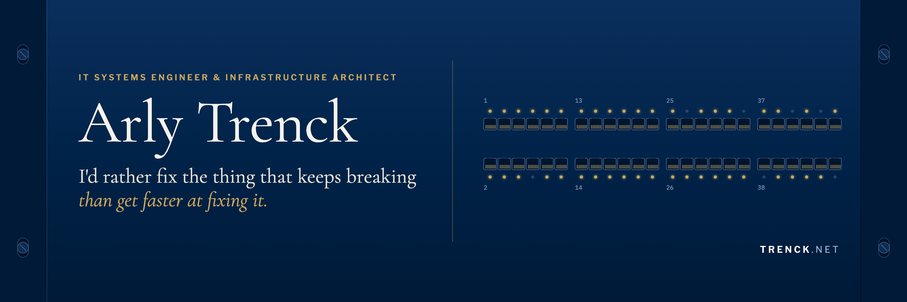
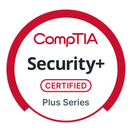
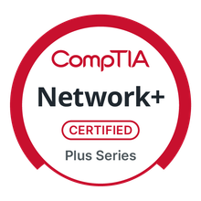
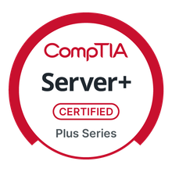
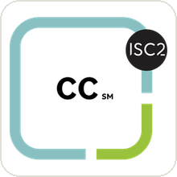
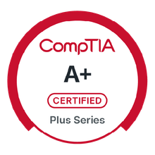
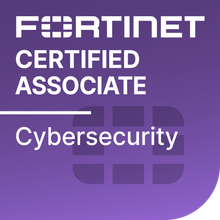

# Arly Trenck

IT systems engineer and infrastructure architect in Fairfield, CT. I run
infrastructure operations for a 29-office residential real-estate brokerage
across Connecticut, New York, and Massachusetts: servers, firewalls, wireless,
identity, and the automation that keeps every site consistent. Single sign-on
and conditional access cover 1,250+ users across Microsoft Entra ID, Okta, and
Google Workspace.

Every office runs one standard, so a fix that works at one site applies to the
other 28. Recurring work gets scripted instead of repeated. Completed work
includes a firewall refresh across all 29 offices with no unplanned
business-hours downtime, 52 access points moved to RUCKUS One cloud management,
and a scripted Windows 11 in-place upgrade across 160 endpoints ahead of end of
support.

## What I run

| Area | Stack |
| --- | --- |
| Systems | Windows Server 2019 / 2022 / 2025, Active Directory & Group Policy, Ubuntu Server LTS, Proxmox VE, VMware, Synology DSM |
| Identity | Microsoft 365, Entra ID, conditional access & MFA, Okta Workforce Identity, SAML SSO, Google Workspace, RBAC & least privilege |
| Network & security | SonicWall firewalls (SonicOS), RUCKUS One, VLANs & subnetting, IPsec & WireGuard VPN, DNS / DHCP, Cisco Umbrella, SentinelOne EDR / XDR |
| Automation | PowerShell, Bash, Ansible, Git, Renovate, NinjaOne, ConnectWise Automate, Freshservice, Auvik, Liongard |
| Backup & recovery | Datto BDR, Druva, Spanning Backup, restic, disaster-recovery planning & restore testing |

## Projects

**[arly-skill](https://github.com/arlytrenck/arly-skill)** takes a situation and
returns the runbook that fits it, names the script that does the work, and
carries my published guidance. It encodes my playbook as an installable agent
skill, built from the public tools and writing below.

**[sysadmin-linux](https://github.com/arlytrenck/sysadmin-linux)** is a Bash
toolkit for Linux host operations: verified backups, container-host drift and
security audits, TLS certificate expiry checks, and runbooks for a full disk, a
leaked secret, and a failed patch. ShellCheck runs in CI.

**[sysadmin-windows](https://github.com/arlytrenck/sysadmin-windows)** is a
PowerShell toolkit for Windows Server: diffable config snapshots including
Hyper-V hosts, account and security audits, patching, and reporting.
PSScriptAnalyzer runs in CI.

**[homelab-public](https://github.com/arlytrenck/homelab-public)** is the Docker
Compose infrastructure behind the homelab on my site, with identifying details
redacted. The hardening conventions, the full set of 69 live Prometheus alerting
rules, and the config that keeps every stack consistent are published unedited.
The runbook and the per-device config stay private.

## Homelab

Cloudflare answers DNS for every subdomain, and the home network opens only
ports 80 and 443. Caddy terminates TLS with certificates issued over DNS-01,
Authelia puts single sign-on and two-factor in front of everything private, and
the request reaches one of 43 containers running as Docker Compose stacks on a
16 vCPU Ubuntu LTS VM under Proxmox VE 9. Prometheus and Loki feed Alertmanager,
which pages Gotify on my phone. Remote access runs over a Tailscale subnet
router, so no admin interface needs a public port.

- **Services.** 43 containers, every one defined in a version-controlled Compose
  stack.
- **Alerts.** 69 Prometheus rules routed through Alertmanager to Gotify.
- **Backups.** Five independent copies, with a restore drill every month that
  reports pass or fail.
- **Rebuild.** The host rebuilds from one Ansible playbook.
- **Access.** Authelia single sign-on and two-factor in front of all 43
  services.

The hardware is a Lenovo ThinkSystem SR650 running Proxmox VE 9 on ZFS, two
Synology NAS units, a Cisco SG350 switch, and a CyberPower UPS watched by NUT
for clean shutdown. [Architecture and rack layout](https://trenck.net/homelab/).

## Certifications

  
  
  
  
  
  
  

<a href="https://www.credly.com/users/arlington-trenck">Verify all seven on Credly</a>

🌐 [trenck.net](https://trenck.net) &nbsp;·&nbsp;
📝 [Blog](https://trenck.net/blog/) &nbsp;·&nbsp;
📄 [Résumé](https://trenck.net/resume/) &nbsp;·&nbsp;
💼 [LinkedIn](https://www.linkedin.com/in/arlytrenck) &nbsp;·&nbsp;
🏅 [Credly](https://www.credly.com/users/arlington-trenck) &nbsp;·&nbsp;
✉️ [arly@trenck.net](mailto:arly@trenck.net)
